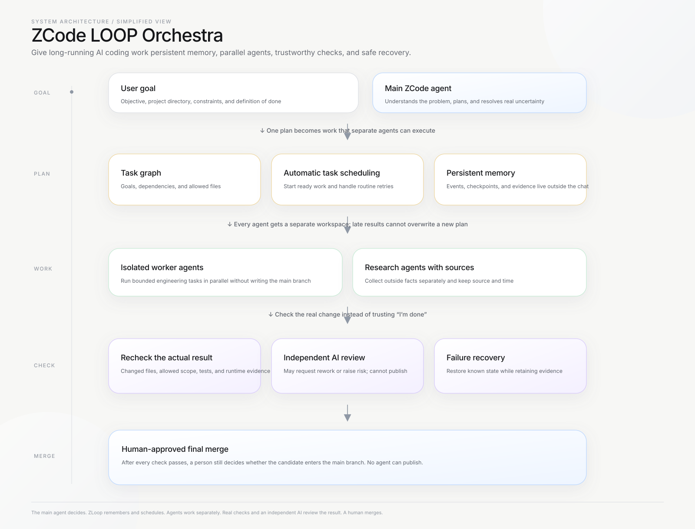

<!-- size-justified: project landing page; raw logs and generated state are excluded. -->

# ZCode LOOP Orchestra

**The control loop that turns ZCode into a continuously running multi-agent engineering team.**

[Highlights](#highlights) · [Control loop](#the-control-loop-is-the-product) · [Quickstart](#quickstart) · [Why LOOP](#why-loop-exists) · [Architecture](#how-loop-works) · [中文](README.zh-CN.md) · [Docs](docs/)

ZCode can start and coordinate agents. LOOP adds the control loop that a long-running engineering workload needs: bounded planning, isolated worktrees, mechanical acceptance, independent audit, continuous refill, and human-controlled release.

Give LOOP a goal and a concurrency target. It divides the work into bounded packets, dispatches them, and fills an open slot when a useful worker finishes. The root conversation stays focused on planning and judgment; scripts maintain routine lifecycle state; independent audit stages check the result; and durable history makes each transition inspectable. You do not have to keep asking the system to continue, and no worker can publish by itself.

## Highlights

- **8–15 physical concurrency:** ZCode LOOP runs a non-blocking worker pool with isolated Git worktrees, so multiple engineering tasks can progress without sharing a writable checkout.
- **Set the target once; keep useful slots filled:** The supervisor counts real workers and refills from a bounded backlog until the work is complete or capacity is exhausted.
- **Three independent model stages:** The root conversation plans, execution agents implement, and audit agents review. Each stage can be assigned its own model and provider; compatible third-party gateways can be used where supported.
- **Triple-audit safety model:** C2C-P challenges the plan before dispatch, mechanical materialization runs the acceptance checks and rolls back failed staging, and C2C-A reviews the result before promotion.
- **About 53% lower first-round input tokens:** Context pruning removes irrelevant tool and skill schemas before they reach an agent, leaving more room for the task itself.
- **Atomic failure containment:** A failed candidate is rejected and its staging state is restored, preventing one poisoned task from cascading into the rest of the wave.
- **True overlap instead of a blocking driver:** The asynchronous thread pool and non-blocking polling keep independent workers moving while the coordinator remains responsive.
- **Inspectable lifecycle evidence:** H0 events, content-addressed blobs, control-database rows, and history commands make each run auditable across failures and restarts.

At a glance: the root conversation judges, code maintains state and concurrency, independent models audit, and a person decides what ships.

## The control loop is the product

Many harnesses can launch an agent batch. LOOP addresses the harder problem: keeping a bounded amount of useful work moving for as long as the backlog lasts, while preventing write collisions, making acceptance reproducible, and reserving release authority for a human.

> **In plain language:** Set the goal and the concurrency target once. LOOP creates task packets, sends them to isolated workers, checks their results, and starts the next packet when a slot opens. Code handles waiting, counting, retries, and state transitions. Only a real exception is sent back to the root conversation for judgment.
>
> **What you get:** more work progresses at the same time, one worker cannot overwrite another worker's checkout, failed work does not poison the whole wave, and a different model can inspect the result before anything is promoted.

The control loop enforces these rules:

1. The root conversation produces a bounded decision skeleton instead of performing the batch work itself.
2. Every work packet declares its goal, authorized paths, acceptance commands, and constraints.
3. A DAG gate rejects cyclic dependencies and overlapping write scopes before dispatch.
4. Desktop or headless workers run in isolated Git worktrees with explicit roles, models, and reasoning limits.
5. Scripts replay acceptance commands, verify diff boundaries, and record typed lifecycle events.
6. The independent audit layer can approve, request rework, rank alternatives, or escalate; it cannot publish.
7. Only material exceptions return to the root conversation. Final merge and release remain human-triggered.
8. Waiting, polling, counting, routine retries, and state transitions belong to scripts or the state machine, not to extra coordinator turns.

**Models make judgments. Code manages state. Independent models audit the work. Humans release it.**

## Quickstart

Give this repository to ZCode or another coding agent and paste:

~~~text
Install ZCode LOOP Orchestra from https://github.com/LEO001020/zcode-loop-orchestra.
Read the repository instructions first. Inspect my environment, show the dry run and
backup plan, wait for my approval, then activate LOOP and verify the installation.
Do not read, print, or change my API credentials.
~~~

Prefer to run it yourself?

~~~powershell
git clone https://github.com/LEO001020/zcode-loop-orchestra.git
cd zcode-loop-orchestra

python -m venv .venv
.venv\Scripts\python -m pip install -e ".[dev]"
.venv\Scripts\python -m zloop.cli doctor
.venv\Scripts\python -m zloop.cli project attach
.venv\Scripts\python -m zloop.cli install
~~~

Use <code>zloop --help</code> to inspect available commands. Start a wave only after the environment check and the plan gate pass.

## Why LOOP exists

LOOP is not just a way to start more agents. Each part addresses a failure mode that appears when a native harness is used for sustained, concurrent engineering:

| Limitation in a native harness | What LOOP changes | Practical benefit |
|---|---|---|
| A batch shrinks as workers finish; a prompt does not reliably refill it. | Count real workers and refill open slots from a bounded packet backlog. | **Sustain useful concurrency** without repeatedly asking for more agents. |
| The same model writes and reviews its own work. | Separate root, execution, and audit model stages. | **Reduce correlated blind spots** with independent model families. |
| Concurrent tasks share a checkout or race on the same mutable state. | Give each launch an isolated Git worktree and keep integration controlled. | **Prevent workers from overwriting one another.** |
| A synchronous driver waits on the first task and makes the rest look parallel. | Use a non-blocking poll loop and an asynchronous worker pool. | **Get real overlap** and keep the coordinator responsive. |
| One failed candidate contaminates later tasks in staging. | Run mechanical acceptance before promotion and restore failed staging atomically. | **Contain failure** instead of cascading it. |
| The coordinator spends expensive turns on routine context and lifecycle work. | Prune irrelevant schemas and let scripts own waiting, counting, retry, and state transitions. | **Spend model capacity on decisions** and leave more room for the task. |
| A run becomes difficult to reconstruct after a failure or restart. | Keep typed H0 events, content-addressed evidence, control-database state, bindings, and recovery history together. | **Explain what happened** and recover from degraded history. |

The 8–15 concurrency figure and the roughly 53% first-round input reduction are project measurements, not official ZCode limits or a promise that every provider and machine will sustain the same load. Tune the target to the local model capacity and hardware.

## How LOOP works

LOOP separates cognition, execution, evidence, review, integration, and release authority:

- The **root stage** turns the user's objective into a bounded plan and adjudicates material uncertainty.
- The **execution stage** runs packets in isolated worktrees through the ZCode worker pool.
- The **mechanical stage** runs tests, schema checks, hashes, and diff-boundary checks independently of the worker's self-report.
- The **audit stage** reviews the evidence using an independently selected model and may approve, request rework, rank candidates, or escalate.
- The **integration stage** serializes accepted writes; the **human stage** alone triggers merge or release.
- The **history and recovery path** exposes runs, stages, evidence, bindings, and degraded history as durable records across failures and restarts.

### Model routing

Root, execution, and audit are separate stages, not one inherited model. Choose the model for each stage in the project configuration. If a third-party model is used, expose it through the Codex-compatible gateway supported by the local ZCode setup. This lets a stronger model spend its budget on planning and adjudication while a faster model handles bounded execution and an independent model checks the result.

### Repository layout

~~~text
src/zloop/       Control plane, worker backend, lifecycle, evidence, and CLI
spec/            Architecture contracts, decisions, invariants, and progress records
tests/           Unit, integration, concurrency, and chaos coverage
plugin/          ZCode plugin distribution files and hooks
docs/            Operational documentation and architecture material
tools/prompt-lab/ Prompt experiments and context-budget checks
pyproject.toml   Build metadata and dependencies
~~~

## Installation and operations

The supported path is an agent-guided, script-executed installation. The scripts inspect the environment, create backups, install only the managed hooks and configuration, and provide a restoration path. The repository does not contain the installed ZCode binary.

### Requirements

- Windows 10/11 x64
- ZCode v3.10.2 or newer
- Python 3.14 or newer
- Git 2.40 or newer
- A working ZCode login or compatible model gateway

### Daily flow

~~~bash
zloop run start "Implement the next bounded change"
zloop stage begin "stage-01" --risk HIGH
zloop wave propose packets.json
zloop wave start W1 --backend codex
zloop stage promote S01
~~~

Run the full test suite locally:

~~~powershell
.venv\Scripts\python -m pytest tests -q
~~~

The current repository validation contains 293 tests. Provider availability, local credentials, and machine-level concurrency remain deployment-specific.

## Security and limitations

- Hooks run as the current user and do not elevate privileges.
- Provider credentials stay in the user's authenticated ZCode or gateway setup; they are not part of this repository.
- The mechanical and audit gates can block or escalate, but they do not grant publication authority.
- The project is designed for one machine and a controlled local workspace, not as a distributed scheduler.
- The documented concurrency and token figures are measurements from the project environment, not official limits of ZCode or any model provider.

## License

ZCode LOOP Orchestra is released under the [MIT License](LICENSE).
