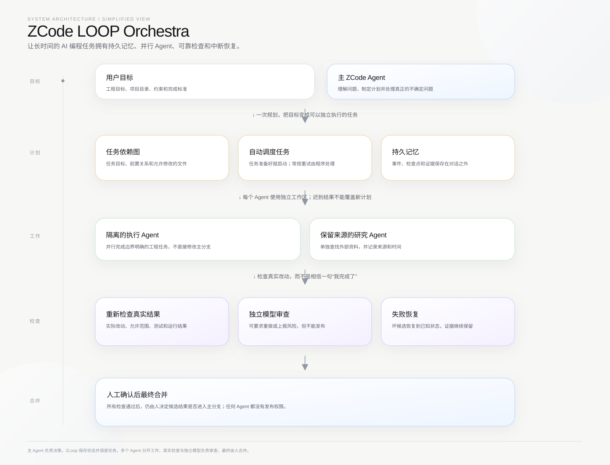
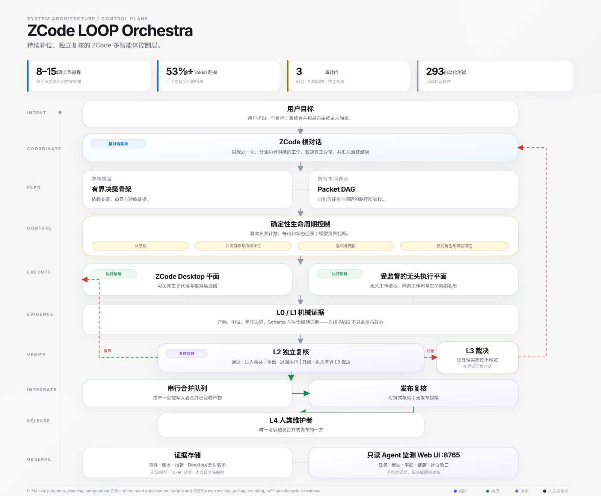

<!-- size-justified: 中文项目主页；不内联日志、清单和运行状态。 -->

# ZCode LOOP Orchestra

**把一次 ZCode 对话变成可并行、可验收、可中断恢复的多 Agent 工程流程。**

[项目亮点](#项目亮点) · [控制回路](#控制回路就是产品) · [快速开始](#快速开始) · [为什么需要 ZLoop](#为什么需要-zloop) · [系统架构](#zloop-如何工作) · [English](README.md) · [文档](docs/)

ZCode 擅长在一段对话中理解问题和作出判断，但持续时间较长的工程任务不能只靠对话记忆来维持：不同 Agent 会在不同时间结束，旧结果可能迟到，并行修改必须相互隔离，每个通过的结果也应当能够重新验证。

ZLoop 是加在 ZCode 外面的本地控制层。它把任务状态保存在对话之外，按依赖启动已经就绪的工作，让每个编码 Agent 使用独立工作区，在安全集成区重新检查返回的改动，并保留中断后继续所需的证据。ZCode 继续负责判断，程序负责维持流程一致，最终合并仍由人决定。

## 项目亮点

- **不会随上下文消失的 Agent 记忆：** 已观察到的事件、精简检查点和证据引用保存在模型上下文之外；压缩上下文、重启会话或任务中断后仍可恢复。
- **并行 Agent 不会互相覆盖：** 每个执行 Agent 使用独立工作区，只有通过检查的变更才会经由受控的暂存区进入候选结果。
- **按任务依赖自动推进：** 前置任务完成后，后续任务才会启动；主对话不必反复记忆“下一步该派谁”。
- **检查真实改动，而不是相信一句“完成”：** ZLoop 检查实际修改了哪些文件，并在安全集成区重新运行验收命令。
- **失败可恢复，旧结果不会串进新计划：** 坏候选会恢复到已知状态；迟到或过期的结果只保留为证据，不能覆盖当前工作。
- **独立模型复核：** 只要宿主环境支持，规划、执行和复核可以分别使用不同模型，避免同一个模型检查自己的假设。
- **带来源的外部研究：** 可选研究任务在独立环境中获取外部资料，保留来源和时间，再把精简证据交回主 Agent。
- **发布权始终在人手里：** Agent 可以提出方案、执行、测试和反驳，但不能自行完成最终合并。

主 Agent 负责决策，ZLoop 保存状态并调度任务，多个 Agent 分开工作，真实检查与独立模型负责审查，最终由人合并。

## 控制回路就是产品

同时启动几个 Agent 并不难。真正困难的是：它们完成、失败、迟到或改错文件以后，整项工程任务还能不能保持一致，能不能从中断处继续，坏结果会不会混进主分支。

> **简单来说：** 你给 ZLoop 一个项目目标和一组任务。它会在依赖满足时启动工作，让每个执行 Agent 使用独立目录，重新检查返回的改动，并在中断后从已保存的状态继续。
>
> **你能直接感受到的变化：** 主对话不再兼任脆弱的“任务数据库”。并行工作更安全，失败不会拖垮整批任务，而且在任何改动进入主分支之前，你都能看到它为什么通过或为什么被拒绝。

这条控制回路遵守八条规则：

1. 主 ZCode Agent 决定项目要做什么，不必亲自完成所有实现工作。
2. 每项任务都写清目标、允许修改的文件、验收方式、依赖关系和限制。
3. 任务依赖图在执行前拒绝循环依赖和互相冲突的写入范围。
4. 每个执行 Agent 获得新的工作区和唯一执行身份。
5. 等待、调度、普通重试、取消和运行状态由程序处理，不额外消耗模型轮次。
6. 返回的改动先进入安全集成区，再由宿主重新检查。
7. 独立复核可以通过、要求重做或提出高风险问题，但不能发布。
8. 只有当候选结果、仓库状态和发布检查一致时，才由人触发最终合并。

**模型负责判断，程序负责状态，可重复的检查决定结果是否合格，人类负责发布。**

## 快速开始

把这个仓库交给 ZCode 或其他编码 Agent：

~~~text
请从
https://github.com/LEO001020/zcode-loop-orchestra
安装 ZCode LOOP Orchestra。
先阅读仓库说明，检查我的 Windows 环境，展示试运行结果和备份方案；
得到我确认后，再安装受管理的 hooks 并验证结果。
不要读取、显示或修改任何 API 凭据。
~~~

如果希望手动安装，请继续阅读[安装](#安装)，或直接打开[中文安装指南](docs/INSTALL.zh-CN.md)。

## 为什么需要 ZLoop

ZLoop 的每项设计，都对应长时间 Agent 工程中会真实出现的问题：

| 没有控制层时会发生什么 | ZLoop 做了什么 | 实际好处 |
|---|---|---|
| 上下文被压缩、会话重启，主 Agent 忘记早先的决定。 | 把可观察历史、精简检查点和精确证据引用保存在模型上下文之外。 | **从持久状态继续，而不是凭记忆重新拼凑整个任务。** |
| 多个 Agent 修改同一个目录，或者读取彼此尚未完成的状态。 | 每个执行 Agent 使用独立工作区，统一在安全集成区组合改动。 | **Agent 之间不会互相覆盖，也不能直接修改主分支。** |
| 主对话被迫充当调度器，不断检查谁做完了、下一步该启动谁。 | 把任务依赖和运行状态交给程序，根据依赖推进已就绪任务。 | **真正并行推进，不必反复输入“继续”。** |
| 执行 Agent 自称成功，但实际改错文件，或者测试结果已经过期。 | 检查真实差异、限制允许修改的文件，并在集成位置重新运行验收。 | **是否通过取决于证据，而不是模型的自信。** |
| 任务或计划已经改变，旧执行结果却在稍后返回。 | 每个结果都必须匹配当前任务版本和执行身份。 | **迟到结果只能成为证据，不能误写进新计划。** |
| 同一个模型既完成工作，又批准自己的答案。 | 允许使用单独路由的模型复核计划或结果，并限制其权限。 | **减少自我审查盲点，同时不把发布权交给审查模型。** |
| 外部研究结果与可信项目状态混在一起。 | 研究任务在独立环境运行，保留来源，并把外部内容明确视为不可信输入。 | **可以利用最新资料，又不会让网页内容控制工作流。** |
| Agent 认为任务完成后就直接合并。 | 要求得到干净、已经验收的候选结果，并由人执行最终命令。 | **不可逆的发布决定仍掌握在维护者手中。** |

## ZLoop 如何工作

图中只使用 AI 工程中常见的概念。系统内部仍会给这些边界分配稳定 ID，从而避免进程崩溃或迟到结果被误认为当前工作，但普通使用者不需要先掌握这些内部名称。

- **主 Agent：** 理解目标、决定下一步计划，并处理真正需要判断的不确定问题。
- **任务依赖图与调度器：** 保存依赖关系，启动已就绪的工作，不让主对话承担日常轮询。
- **执行 Agent：** 在独立工作区完成边界明确的任务；当前默认执行后端使用 Codex SDK。
- **可重复验收：** 检查真实差异、允许修改的文件、测试、哈希、Git 状态和其他验收证据。
- **独立模型审查：** 只整理与当前计划或结果有关的材料交给独立模型，并把回应记录为外部不可信证据。当前命令不会自动调用模型。
- **持久记忆与恢复：** 保存已观察事件和精简检查点，支持精确回查，并让当前仓库现实始终高于历史摘要。
- **安全集成区与人工发布：** 在主分支之外组装候选结果，全部检查通过后仍由人触发快进合并。

### 模型选择

主 Agent、执行 Agent 和复核模型是三种不同职责。只要宿主配置支持独立路由，就可以分别指定模型或服务商；第三方模型需要通过本机 ZCode 或 Codex 环境支持的兼容网关接入。

项目不会把“换了模型”自动当成“已经独立”。只有能够观察到的模型身份和证据范围才会被记录；无法观察时就明确记为未知。

> [!NOTE]
> ZCode LOOP Orchestra 是独立社区项目。它由本地 Python 控制层和受管理的 ZCode hooks 组成，不分发 ZCode、不修改其二进制文件，也不包含任何模型服务商凭据。

## 安装

### 环境要求

- Windows 10 或 11，x64。
- Python 3.11 或更高版本。
- Git。
- 支持本地 hooks、能够正常运行的 ZCode。
- 执行 Agent 需要使用后端时，已有可用的 Codex 兼容登录或网关。

### 安装命令

~~~powershell
git clone https://github.com/LEO001020/zcode-loop-orchestra.git
cd zcode-loop-orchestra

python -m venv .venv
.\.venv\Scripts\python.exe -m pip install -e ".[dev]"
.\.venv\Scripts\python.exe -m zloop.cli doctor
.\.venv\Scripts\python.exe -m zloop.cli project attach
.\.venv\Scripts\python.exe -m zloop.cli install
~~~

安装器会检查环境、备份自己管理的 hooks 配置，并提供卸载路径。它不会读取或配置 API key。

### 运行一批有边界的任务

~~~powershell
zloop run start "Implement the next bounded change"
zloop stage begin --objective "Implement the next bounded change" --risk NORMAL
zloop wave propose packets.json
zloop wave start W1 --backend codex
zloop stage promote S01
~~~

这些命令名称只是实现层术语：

| 命令术语 | 白话含义 |
|---|---|
| Run | 一项目标 |
| Stage | 一个边界明确的工程阶段 |
| Packet | 交给一个执行 Agent 的任务 |
| Wave | 按依赖共同推进的一组任务 |
| Materialize | 把 Agent 的改动放进暂存区并重新验收 |
| Promote | 由人触发最终合并 |

高风险任务可能要求在执行前记录一次计划复核，并在最终合并前记录一次结果复核。恢复、研究和复核命令请参阅 [docs/](docs/)。

### 卸载

~~~powershell
.\.venv\Scripts\python.exe -m zloop.cli uninstall
~~~

## 仓库结构

~~~text
src/zloop/        控制、调度、执行、记忆、证据和命令行
plugin/           可选的 ZCode 插件文件和 Agent 角色
docs/             安装、操作与架构说明
spec/             详细工程约束和设计决策
tests/            单元、集成、并发与故障测试
tools/prompt-lab/ 提示词和上下文预算实验
~~~

## 验证

~~~powershell
$env:PYTHONPATH = (Resolve-Path "src").Path
python -m pytest tests -q
~~~

CI 与本地测试覆盖运行状态、任务边界、迟到结果拒绝、暂存区恢复、证据捕获、会话恢复、安装和晋升安全。模型路由和服务商容量仍需在用户自己的环境中实测。

## 安全边界与限制

- hooks 以当前用户身份运行，不会自动提升权限。
- 凭据保存在用户自己的 ZCode 或网关配置中，不进入本仓库。
- 工作区和路径检查保护的是集成边界，不等于操作系统级安全沙箱。
- 网页研究与外部模型复核始终被视为不可信输入。
- 执行 Agent 和复核模型都没有发布权限。
- 当前实现是单机控制层，不是分布式调度系统。
- 可持续并发数量取决于执行后端、模型服务商、仓库和本机硬件。

## 许可证

MIT © 2026 [LEO001020](https://github.com/LEO001020)。详情参见 [LICENSE](LICENSE) 和 [CONTRIBUTING.md](CONTRIBUTING.md)。
