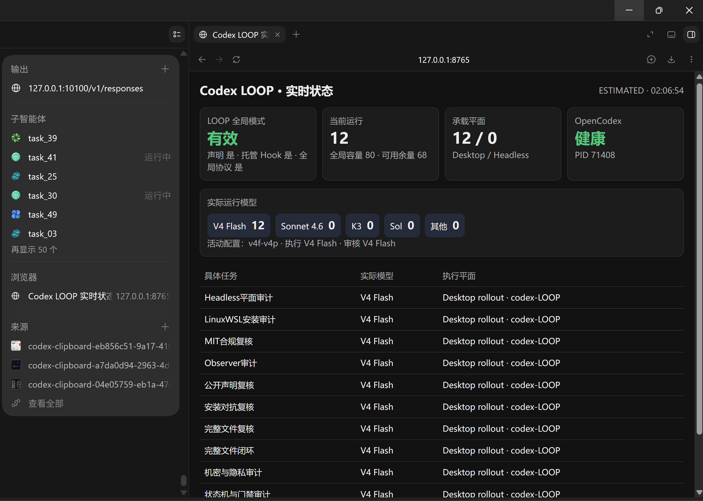

# zcode-loop-orchestra — ZCode 原生多智能体控制回路与三重审计系统
<!-- size-justified: repository README; documents architecture overview, harness layout, and operational notes. -->

[](LICENSE)
[]()
[]()
[]()
[]()

围绕 **ZCode** 构建的高性能、高韧性原生多智能体调度与控制回路 Harness：
- **根会话唯一定权**：ZCode 根对话（Gemini 3.8 Flash / GLM-5.3）作为唯一规划与裁决中枢，负责任务切片与全局把控。
- **三重审计架构 (D-25)**：
  1. **审级 1 · C2C-P 计划前置审计**：在信息量最少、决策价值最高、Token 成本最低的规划层，通过 ChatGPT 网页端独立新线程前置反驳架构漏洞与盲区；HIGH/CRITICAL 强制拦截。
  2. **审级 2 · 机械物化验收与防毒化回滚**：宿主自动化测试（pytest/build）机械验收；单测失败坚决执行 `git reset --hard` + `git clean -fdx` 原子硬重置，彻底根除多任务级联雪崩误杀 (P0-2)。
  3. **审级 3 · C2C-A 结果审计门禁**：通过全限定路由直通独立的专职审查官（GLM-5.3 子代理 `af9697f5/glm-5.3`）进行只读代码审查，角色感知门禁阻断非合格晋升。
- **8–15 物理并发执行**：非阻塞 JIT 线程池派发，私有 Git Worktree 物理隔离，具备 4 次 `.git/index.lock` 指数退避自愈与 429 速率限制重试。
- **上下文深度瘦身**：物理关闭 14 个无关 MCP/Skills 架构注入，首轮输入 Token 净削减 **-53.38%**（单轮立省 14,336 Tokens），子代理每轮纯净控制在 2,300 Tokens 左右。

---

## 核心架构视觉图



<p align="center"><sub>在一个界面中清晰掌握所有本地活跃 Agent、物理执行环境、实际模型分配与并发运行状态。</sub></p>


<p align="center"><sub>简化拓扑：根智能体做认知规划，冷调度器维持物理并发，宿主机械测试防毒化，异构模型独立审计，人类拥有最终发布权。可在浏览器打开 <a href="docs/architecture-interactive.html">docs/architecture-interactive.html</a> 体验全景交互演示。</sub></p>


<p align="center"><sub>完整全景：规划层前置反驳、8–15 物理并发调度、Staging 原子硬回滚、独立全限定子代理门禁与不可篡改 H0/H1 证据链。</sub></p>

---

## 1. 5 分钟极速部署

### 前置环境
- Windows 10/11 x64
- Git 2.40+ (推荐 Git Bash)
- Python 3.14+ (系统内置 SQLite 3.50.4+ 已通过 `DELETE+EXTRA` 崩溃一致性门禁自动守护)
- ZCode v3.10.2+

### 第一步：安装 ZLoop 运行环境

```bash
# 克隆仓库
git clone https://github.com/LEO001020/zcode-loop-orchestra.git
cd zcode-loop-orchestra

# 建立虚拟环境并安装开发依赖
python -m venv .venv
.venv/Scripts/python -m pip install -e ".[dev]"

# 运行环境自检（检查 SQLite 门禁与 Hook 状态）
.venv/Scripts/python -m zloop.cli doctor
```

### 第二步：纳管当前工作区并安装 ZCode 物理 Hooks

```bash
# 将当前工程纳管至 ZLoop 数据平面
.venv/Scripts/python -m zloop.cli project attach

# 安装用户级 ZCode hooks（SessionStart, UserPromptSubmit, PostToolUse 等 5 大事件）
.venv/Scripts/python -m zloop.cli install
```

### 第三步：部署纯净子代理 Profiles

将经过架构裁剪、剥离了 26 个 MCP 工具负荷的两个原生子代理配置文件复制到用户代理根目录：

```bash
mkdir -p "$USERPROFILE/.zcode/agents"
cp plugin/agents/zloop-worker.md "$USERPROFILE/.zcode/agents/"
cp plugin/agents/zloop-auditor.md "$USERPROFILE/.zcode/agents/"
```

*注意：`zloop-auditor.md` 已配置为全限定模型标识 `af9697f5-a1f2-4616-8350-e14311d14fda/glm-5.3`，在新会话中将 100% 物理直通你的独立 GLM-5.3 审查节点。*

---

## 2. 为什么需要 ZCode-ZLoop

许多多智能体框架仅仅是简单的“外层嵌套调用”，在单机落地长程、高并发、复杂工程任务时，往往会遭遇四大致命泥潭：

1. **同构偏好与自我盲区**：单一大模型体系往往倾向于给自己写出的 Bug 点赞（Correlated Errors 实证：350+ 模型越强错误越同质）。ZLoop 通过 **ChatGPT 规划反驳 + GLM-5.3 独立代码审查** 实施异构制衡；
2. **多任务并发级联毒化**：多任务同时合入公共分支时，一旦某任务单测失败且残留有毒 Commit，后续原本正确的任务全被连环击毙。ZLoop 的 **Staging 原子硬回滚（`git reset --hard` + `git clean -fdx`）** 确保单点失败零扩散；
3. **驱动循环同步假并发**：传统实现往往在首个任务的同步等待上卡死主线程。ZLoop 引入 **JIT 异步线程池与非阻塞 `poll()` 机制**，实现毫秒级轮询与真正 8–15 物理并发重叠执行；
4. **巨量上下文税**：常规客户端默认注入数十个 MCP 工具与技能元数据，导致每轮对话初始直接背负 2.6 万 Tokens。ZLoop 通过**物理禁用无关 Skills 与 Profile 白名单过滤**，使首轮输入骤降至 1.2 万 Tokens，子代理压至 2,300 Tokens。

---

## 3. 日常开发标准操作流水线 (Mode G)

### 步骤 1：开启任务阶段并提出 Wave 提案

```bash
# 启动业务 Run
zloop run start "构建核心支付模块"

# 开启 HIGH 风险等级阶段（激活全套三重审计门禁）
zloop stage begin "payment_v1" --risk HIGH

# 校验并提交不重叠的切片任务包
zloop wave propose packets.json
```

### 步骤 2：C2C-P 规划前置审查

```bash
# 生成脱敏的计划审查包（包含目标、约束与未知项，严格 ≤8,000 字符）
zloop c2c prepare --role plan --file plan_summary.txt

# 将包复制到 ChatGPT 网页端独立新线程获取反驳意见，录入系统
zloop c2c record --c2c C2C001 --identity surface=chatgpt_web --file chatgpt_verdict.txt
```

### 步骤 3：发射并发任务 (8–15 并发)

```bash
# 计划门放行，并发在各自私有 Worktree 中执行编码与本地验证
zloop wave start W1 --backend codex
```

### 步骤 4：机械验收测试与 C2C-A 结果审计

```bash
# 宿主自动执行 pytest/build 机械验收；失败自动硬回滚
# 验收通过后，准备 Diff 审查包
zloop c2c prepare --role result --file diff.txt

# 由 GLM-5.3 专职子代理审查并录入结果
zloop c2c record --c2c C2C002 --identity surface=glm5.3 --file review_pass.txt

# 角色感知门禁确认 role=result 就位，安全快进晋升合入主分支
zloop stage promote S01
```

---

## 4. 仓库拓扑与模块分布

```
zcode-loop-orchestra/
├── src/zloop/
│   ├── backend/          # CodexSdkBackend (异步线程池, poll 轮询, 429 退避)
│   ├── metrics/          # 自动化运维分析器 (tokens, latency, concurrency, c2c_stats)
│   ├── research/         # Kimi 搜索器化信息管道 (disabled_tools 保护)
│   ├── c2c.py            # 跨模型审计包序列化、脱敏与 Hash 校验
│   ├── cli.py            # 统一 CLI 命令行系统 (run, stage, wave, c2c, install)
│   ├── db.py             # SQLite S 库 (DELETE+EXTRA 门禁, busy_timeout=30s)
│   ├── evidence.py       # 不可篡改 H0 NDJSON 事件流与 CAS Blob 存储
│   ├── hook.py           # 具备 cwd 项目作用域安全过滤的物理进程 Hook
│   ├── materialize.py    # 变更物化、宿主验收与原子硬重置防毒化回滚
│   ├── promote.py        # CAS Fast-Forward 快速合并与 Git 物理判据
│   ├── supervisor.py     # 冷调度器、50ms 错峰发射与阶段版本栅栏
│   └── workspace.py      # Git Worktree 隔离与 index.lock 退避自愈
├── spec/                 # 权威设计规范全书 (VOL-00 至 VOL-22)
│   ├── DECISIONS.md      # 架构决议日志 (D-1 至 D-25 完整演进证据链)
│   ├── PROGRESS.md       # 里程碑与物理验收对账账本
│   └── VOL-*.md          # 宪章、数据模型、状态机、平台契约与混沌测试
├── tests/                # 293 项全量自动化测试套件 (覆盖单元、集成与并发)
├── tools/prompt-lab/     # SHA256 门禁绑定、原像锚点系统提示词实验台
├── plugin/               # ZCode 用户级精简子代理 Profiles (worker / auditor)
├── docs/                 # 详细操作指南、接口契约与交互式架构网页
└── pyproject.toml        # 构建配置与依赖锁定
```

---

## 5. 生产级自动化验证与不变量保证

ZLoop 全量测试套件严格执行对 **架构不变量 I1–I44** 的物理守卫：

```bash
# 运行全库 293 项自动化测试
.venv/Scripts/python -m pytest tests -v
```

核心不变量覆盖：
- **I1**：`disable(ZLoop) => native ZCode semantics restored`（卸载即恢复原生，零污染残留）。
- **I3**：H0 记录失败走柔性降级（`history_degraded=true`，原生认知继续执行）。
- **I4**：S 控制库事务失败走坚决阻断（Fail-Closed，立刻停止生命周期变更）。
- **I6**：Packet 验收受 `stage_revision ∧ packet_revision ∧ active_launch_id` 三重版本栅栏守卫。
- **I13**：任何敏感凭据绝不在未脱敏前落盘或进入日志。
- **I30/I39**：晋升合入必须基于干净工作树与完全匹配的基线哈希，执行原子快进。
- **I34**：每个物理任务独占独立可写的 Git Worktree。
- **P0-1**：非阻塞 `poll()` 彻底粉碎单线程假并发死锁。
- **P0-2**：验收失败立即硬重置（`git reset --hard` + `git clean -fdx`），保证 Staging 绝对洁净。

---

## 6. 开源许可

本项目基于 [MIT License](LICENSE) 开源许可协议发布。
